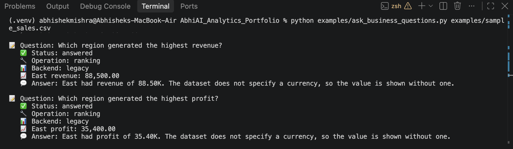

# AbhiAI Analytics Engine

**A local-first business analytics project that combines Python, Pandas and DuckDB with evidence-grounded AI-assisted explanations. It analyzes structured business datasets, calculates KPIs, identifies trends and performance differences, answers analytical questions, and produces structured business reports while keeping numerical reasoning inside deterministic analytics code.**
## Demo

### Natural-Language Business Analysis


---

## Why This Project Exists

This portfolio project demonstrates the ability to build a production-grade business analytics engine that:

- **Scales to millions of rows** using DuckDB's columnar analytics without loading data into memory
- **Falls back to Pandas** for smaller datasets and compatibility
- **Answers natural-language business questions** through a typed, validated intent layer (no arbitrary SQL execution)
- **Generates structured business reports** with full evidence traceability
- **Validates AI-generated explanations** against ground-truth analytics to prevent hallucination
- **Works entirely offline** — no cloud APIs required; local Ollama integration is optional

---

## Key Features

### Data Loading & Backend Selection
- **CSV/XLSX loading** with size and row limits for safety
- **Automatic backend selection**: Pandas for standard datasets, DuckDB for large-scale data
- **Explicit DuckDB opt-in** for scalable analytics (no silent fallbacks)
- **Schema discovery** via conservative alias matching (no invented metrics)

### Analytics Capabilities
- **Full-dataset KPIs**: Revenue, Cost, Profit, Units Sold, Profit Margin
- **Grouped analysis**: By Region, Product, Sales Channel (configurable dimensions)
- **Time-series aggregation**: Daily, Monthly, Quarterly, Yearly granularities
- **Period comparisons**: Adjacent-period changes with percentage calculations
- **Trend detection**: Conservative classification (increasing, decreasing, stable, volatile) — not forecasting
- **Contribution analysis**: Percentage share of totals by dimension
- **Ranking**: Top/bottom performers with bounded results
- **MAD-based anomaly detection**: Robust z-score (|z| ≥ 3.5) on aggregate series
- **Profitability relationships**: Revenue-cost-profit dynamics

### Natural-Language Questions (Phase 5B)
- **Typed intent parsing**: KPI lookup, ranking, comparison, trend, contribution, profitability, anomaly, diagnostic, summary
- **Schema-aware validation**: Rejects unavailable metrics/dimensions
- **Ambiguity handling**: Returns clarification requests for underspecified questions
- **Safety**: Blocks prompt injection, SQL execution, shell commands, external API calls
- **Deterministic core**: Works without any LLM; optional local Ollama for paraphrasing only

### Evidence-Grounded Explanations (Phase 5C)
- **Deterministic rendering**: Concise, Standard, Detailed modes
- **Currency discipline**: No invented currency symbols; values shown as currency-neutral
- **Optional local LLM**: Bounded context (12K chars), JSON output, max 2 attempts, then deterministic fallback
- **Faithfulness validation**: Rejects unsupported numbers, currency, metrics, categories, periods, external causes, forecasts

### Structured Business Reports (Phase 5D)
- **Three report types**: Business Overview, Sales Performance, Financial Performance
- **Three detail levels**: Executive (5 findings), Standard (10), Detailed (20)
- **Typed sections**: Executive Summary, KPI Overview, Revenue/Cost/Profitability Analysis, Trend, Dimension Performance, Contribution, Anomalies, Limitations
- **Chart specifications**: KPI cards, Line charts (time series), Bar charts (dimension performance)
- **Full traceability**: Every KPI, finding, section, chart links to evidence IDs
- **Serialization**: JSON round-trip with validation

### Testing & Validation
- - **39 automated tests** covering business intelligence, natural-language questions, grounded    responses, and structured reports
- **1M-row benchmark** documented with measured timings
- **Deterministic KPIs**: Reproducible results across backends

---

## Architecture

```
CSV/XLSX
    ↓
DataManager (backend-aware registry)
    ↓
┌─────────────────────────────────────┐
│  Pandas Engine (legacy)             │  ← Standard datasets, in-memory
│  DuckDB Engine (scalable)           │  ← Large datasets, disk-backed
└─────────────────────────────────────┘
    ↓
BusinessInsightEngine (Phase 5A)
    ↓  deterministic aggregates → insights
BusinessQuestionEngine (Phase 5B)
    ↓  typed intent → validated analytics
BusinessResponseEngine (Phase 5C)
    ↓  grounded rendering + optional LLM + faithfulness check
BusinessReportEngine (Phase 5D)
    ↓  structured report with evidence traceability
```

**Why the LLM is not the calculator:** All numerical reasoning happens in the deterministic analytics engines (Pandas/DuckDB). The LLM (if available) only receives pre-computed facts and evidence, and its output is validated against those facts before being shown to the user.

---

## Technology Stack

| Layer | Technology |
|-------|------------|
| Analytics Engines | DuckDB 1.2+, Pandas 3.0+ |
| Data Loading | Pandas (CSV/XLSX) |
| Query Safety | Custom parameterized query builder + identifier validation |
| Optional LLM | Ollama (local, qwen3:8b) — entirely optional |
| Testing | pytest, unittest |
| Language | Python 3.10+ |

---

## Quick Start

### Installation

```bash
# Clone and enter the project
cd abhiai-analytics-engine

# Create virtual environment
python -m venv .venv
source .venv/bin/activate

# Install dependencies
pip install -r requirements.txt

# Optional: Install Ollama for local LLM support
# pip install -r requirements.txt -e ".[ollama]"
```

### Run Examples

```bash
# Basic analysis (load data, generate insights)
python examples/basic_analysis.py examples/sample_sales.csv

# Ask business questions
python examples/ask_business_questions.py examples/sample_sales.csv

# Generate structured reports
python examples/generate_report.py examples/sample_sales.csv
```

### Use in Your Code

```python
from abhiai_analytics import DataManager

manager = DataManager()

# Load dataset (pandas backend)
result = manager.open("data/sales.csv")

# Or load with DuckDB for large datasets
result = manager.open("data/large_sales.csv", mode="duckdb")

# Generate structured insights
insights = manager.generate_business_insights(granularity="monthly")

# Ask a natural-language question
answer = manager.ask_business_question("Which region has the highest profit?")

# Get a grounded explanation
response = manager.explain_business_question("Why did profit change?")

# Generate a structured business report
report = manager.generate_business_report(
    report_type="financial_performance",
    detail_level="standard",
    language="english"
)

# Access report as JSON
import json
print(json.dumps(report.to_dict(), indent=2, default=str))
```

---

## Example Dataset

The repository includes a small synthetic dataset: `examples/sample_sales.csv`

```csv
Order Date,Region,Item Type,Sales Channel,Total Revenue,Total Cost,Total Profit,Units Sold
2026-01-01,North,Electronics,Online,15000.00,9000.00,6000.00,50
2026-01-15,South,Clothing,Offline,8000.00,4800.00,3200.00,80
...
```

**Columns:**
- `Order Date` — Transaction date
- `Region` — Sales region (North, South, East, West, Central)
- `Item Type` — Product category (Electronics, Clothing, Home & Garden)
- `Sales Channel` — Online or Offline
- `Total Revenue` — Revenue amount
- `Total Cost` — Cost amount
- `Total Profit` — Profit amount (Revenue - Cost)
- `Units Sold` — Quantity sold

---

## Example Business Questions

| Question | Intent |
|----------|--------|
| "What is our total revenue?" | KPI Lookup |
| "Which region generated the highest revenue?" | Ranking |
| "How is revenue changing over time?" | Trend |
| "Compare revenue and cost" | Comparison |
| "Did costs increase faster than revenue?" | Comparison (speed) |
| "Which region contributed most to revenue?" | Contribution |
| "Why did profit change?" | Diagnostic |
| "Are there unusual regional revenue values?" | Anomaly |
| "Explain the business performance simply." | Summary |

---

## Example Outputs

### Structured Insight (Phase 5A)
```json
{
  "category": "kpi",
  "title": "Revenue overview",
  "summary": "Observed revenue is 294,300.00.",
  "interpretation_type": "observation",
  "evidence_strength": "strong",
  "metric": "revenue",
  "current": 294300.0,
  "evidence": [{
    "description": "Full-dataset revenue aggregate",
    "values": {"revenue": 294300.0},
    "method": "deterministic aggregation"
  }]
}
```

### Grounded Response (Phase 5C)
```
Total revenue was 294.30K. North had the highest revenue at 96.50K. 
Evidence: Full-dataset revenue aggregate; Bounded grouped aggregate ranking. 
Limitations: The dataset does not specify a currency, so the value is shown without one.
```

### Structured Report (Phase 5D)
```json
{
  "report_id": "a1b2c3d4...",
  "title": "Business Overview",
  "report_type": "business_overview",
  "status": "complete",
  "dataset": {"filename": "sample_sales.csv", "row_count": 24, "backend": "legacy"},
  "kpis": [{"metric": "revenue", "raw_value": 294300.0, "formatted_value": "294.30K"}],
  "sections": [...],
  "key_findings": [...],
  "chart_specs": [...],
  "evidence": [...],
  "generation_method": "deterministic",
  "faithfulness_status": "not_required"
}
```

---

## Large-Data Architecture

For datasets exceeding memory limits (100K+ rows), use the **DuckDB backend**:

```python
# Explicit opt-in for scalable analytics
result = manager.open("data/million_rows.csv", mode="duckdb")

# All analytics operations work without materializing the full dataset
insights = manager.generate_business_insights()  # Uses DuckDB aggregates
answer = manager.ask_business_question("Which region has highest profit?")  # DuckDB grouped analysis
report = manager.generate_business_report()  # DuckDB time-series + grouped aggregates
```

**Key properties:**
- CSV registered as a DuckDB view — no pandas DataFrame created
- Full-dataset sums, grouped analysis, time-series aggregation executed in DuckDB
- Bounded result sets: preview ≤100 rows, grouped ≤1,000 rows, time-series ≤10,000 rows
- Zero raw rows transferred to Python for analytics operations

---

## 1M-Row Benchmark

Documented from development environment testing:

| Metric | Value |
|--------|-------|
| **Dataset** | 1,000,000 rows × 14 columns, 119 MB (synthetic repetition of 50K source) |
| **Hardware** | Apple Silicon Mac, 16GB RAM, macOS |
| **Backend** | DuckDB (in-memory, 4GB limit, 4 threads) |
| **Registration** | ~6.9 seconds |
| **Structured Report Generation** | ~0.72 seconds |
| **KPI Totals** | Revenue: 1,323,716,137,624.38<br>Cost: 933,157,398,659.40<br>Profit: 390,558,738,964.99<br>Units: 4,999,618,980<br>Margin: 29.50% |

> **Limitations**: These are measured results from a specific development environment with a synthetic dataset (repeated 50K pattern). Performance will vary with hardware, data distribution, column types, and query complexity. The benchmark CSV is not included in this repository.

See [docs/BENCHMARK.md](docs/BENCHMARK.md) for full details.

---

## Evidence-Grounded AI Design

This project implements a **safe architectural principle**:

```
User Question
    ↓
Structured Intent (typed, validated)
    ↓
Validated Analytics Operation (deterministic)
    ↓
Trusted Analytics Engine (Pandas/DuckDB)
    ↓
Structured Evidence (bounded, traceable)
    ↓
Grounded Response (deterministic + optional LLM)
    ↓
Faithfulness Validation (rejects hallucination)
```

**Safety guarantees:**
- No arbitrary SQL execution — only parameterized, validated queries
- No `eval`/`exec` — all code paths are static
- No filesystem/shell/network authority granted to LLM
- LLM output validated against ground-truth facts before display
- Deterministic fallback always available when LLM unavailable or fails validation

### Faithfulness Validation Examples

| LLM Output | Evidence | Result |
|------------|----------|--------|
| "Revenue was 90B" | Revenue = 66.19B | ❌ Rejected (unsupported number) |
| "Revenue was $66.19B" | Currency unknown | ❌ Rejected (unsupported currency) |
| "South had highest revenue" | North had highest | ❌ Rejected (unsupported category) |
| "Profit fell due to competitors" | External cause unknown | ❌ Rejected (unsupported external cause) |
| "Revenue will grow 20% next year" | No forecasting model | ❌ Rejected (unsupported forecast) |
| "Revenue fell by 8.2%" | Revenue change = -8.2% | ✅ Accepted (safe paraphrase) |

---

## Testing

```bash
# Run all tests
python -m pytest tests/ -v

# Run with coverage
python -m pytest tests/ --cov=abhiai_analytics --cov-report=term-missing

# Run specific test modules
python -m pytest tests/test_business_intelligence.py -v
python -m pytest tests/test_business_questions.py -v
python -m pytest tests/test_business_responses.py -v
python -m pytest tests/test_business_reports.py -v
```

**Test Coverage Areas:**
- CSV loading (pandas + DuckDB backends)
- Schema discovery and conservative alias matching
- KPI calculation (revenue, cost, profit, units, margin)
- Grouped analysis (dimension ranking, contribution)
- Time-series aggregation (period comparison, trend detection)
- MAD-based anomaly detection
- Question interpretation (deterministic + optional semantic)
- Unsupported/ambiguous question handling
- Prompt injection and SQL injection resistance
- Grounded response rendering (concise/standard/detailed)
- Faithfulness validation (numbers, currency, categories, periods, causes, forecasts)
- Structured report generation (all types, detail levels, serialization)
- Backend preservation (DuckDB stays DuckDB, no pandas materialization)
- Bounded aggregate results (no raw row materialization)

---

## Development Approach

> **Development Approach**
>
> Built through an AI-assisted development workflow using OpenAI Codex and NVIDIA Nemotron, with Python, SQL/DuckDB, data analytics, testing, and validation. I defined the product requirements, feature specifications, testing criteria, and validation goals, while Codex and Nemotron assisted with implementation, debugging, testing, and iterative development.

This project was not generated entirely autonomously, nor was every line manually written. The architecture, safety boundaries, validation logic, and test criteria were human-defined; implementation details were AI-assisted.

---

## Current Limitations

- **Schema discovery** uses conservative exact-alias matching — ambiguous columns remain unsupported
- **Time-series** requires at least 4 valid periods for trend classification
- **Anomaly detection** requires at least 5 aggregate points and uses conservative MAD threshold (|z| ≥ 3.5)
- **Profit margin** undefined when revenue is zero
- **Currency** metadata not extracted from datasets — all monetary values are currency-neutral
- **Causality** not established — insights describe mathematical relationships, not external reasons
- **Forecasting** not supported — trend classification is descriptive only
- **Optional LLM** requires local Ollama with qwen3:8b model — cloud APIs not supported
- **No GUI** — this is a library/CLI portfolio project
- **No data cleaning/transformation** — focused on analytics only

---

## Future Improvements

- Parquet file support for DuckDB backend
- Additional aggregation functions (median, std, var)
- Multi-column group-by support
- Export to PDF/Excel for reports
- Web API wrapper (FastAPI)
- Dashboard visualization components
- More sophisticated anomaly detection (seasonal decomposition)
- Cross-dataset joins and blending

---

## Project Structure

```
abhiai-analytics-engine/
├── src/
│   └── abhiai_analytics/
│       ├── __init__.py           # Main exports
│       ├── data/                 # Data loading & management
│       │   ├── __init__.py
│       │   ├── data_loader.py    # CSV/XLSX loading
│       │   ├── data_manager.py   # Dataset registry, backend selection
│       │   ├── scalable_store.py # DuckDB dataset store
│       │   ├── types.py          # DatasetInfo, DatasetLoadResult
│       │   └── path_parser.py    # Safe path parsing
│       ├── analytics/            # Analytics engines
│       │   ├── __init__.py
│       │   ├── types.py          # Analytical types & metadata
│       │   ├── safety.py         # Query safety & validation
│       │   ├── duckdb_engine.py  # DuckDB implementation
│       │   └── pandas_engine.py  # Pandas implementation
│       ├── intelligence/         # Business intelligence (Phases 5A-5D)
│       │   ├── __init__.py
│       │   ├── models.py         # Core insight/evidence types
│       │   ├── schema.py         # Conservative schema discovery
│       │   ├── anomalies.py      # MAD anomaly detection
│       │   ├── comparisons.py    # Period comparisons
│       │   ├── trends.py         # Trend classification
│       │   ├── business_insights.py      # Phase 5A
│       │   ├── query_engine.py           # Phase 5B
│       │   ├── query_models.py
│       │   ├── query_interpreter.py
│       │   ├── response_engine.py        # Phase 5C
│       │   ├── response_models.py
│       │   ├── response_formatting.py
│       │   ├── faithfulness.py           # Validation
│       │   ├── report_engine.py          # Phase 5D
│       │   ├── report_models.py
│       │   └── report_validator.py
│       ├── questions/            # Reserved for future use
│       ├── responses/            # Reserved for future use
│       └── reports/              # Reserved for future use
├── examples/
│   ├── sample_sales.csv          # Synthetic example dataset
│   ├── basic_analysis.py         # Load data, generate insights
│   ├── ask_business_questions.py # Natural-language Q&A
│   └── generate_report.py        # Structured report generation
├── tests/                        # Unit tests (to be created)
├── docs/
│   ├── ARCHITECTURE.md           # Architecture documentation
│   └── BENCHMARK.md              # 1M-row benchmark details
├── fundamentals/
│   ├── README.md                 # Reserved for Python/SQL exercises
│   ├── python/
│   └── sql/
├── README.md                     # This file
├── LICENSE                       # MIT License
├── requirements.txt              # Core dependencies
├── pyproject.toml                # Package configuration
└── .gitignore                    # Git ignore rules
```

---

## License

MIT License — see [LICENSE](LICENSE) for details.

---

## Acknowledgments

- **DuckDB** team for the exceptional analytical database
- **Pandas** team for the foundational data analysis library
- **Ollama** team for local LLM infrastructure
- This portfolio project extracts and sanitizes analytics capabilities from the private **AbhiAI** project (not publicly available)